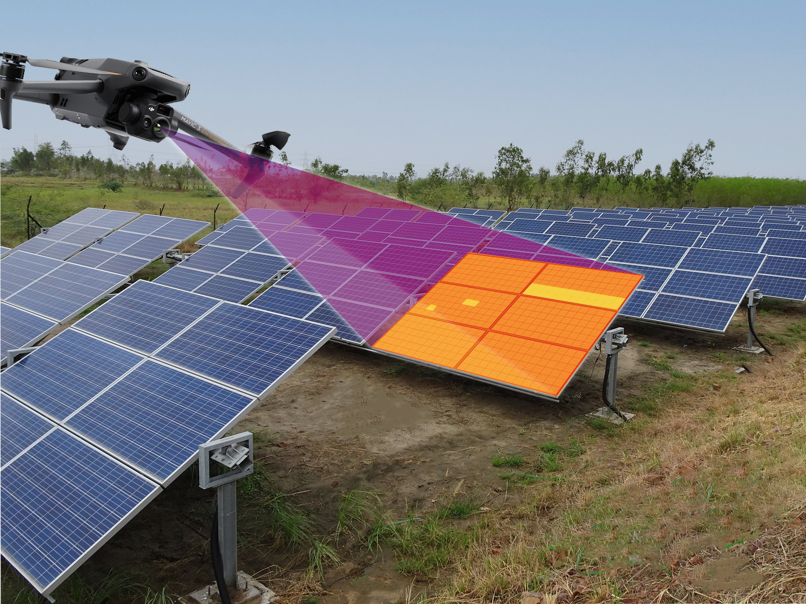
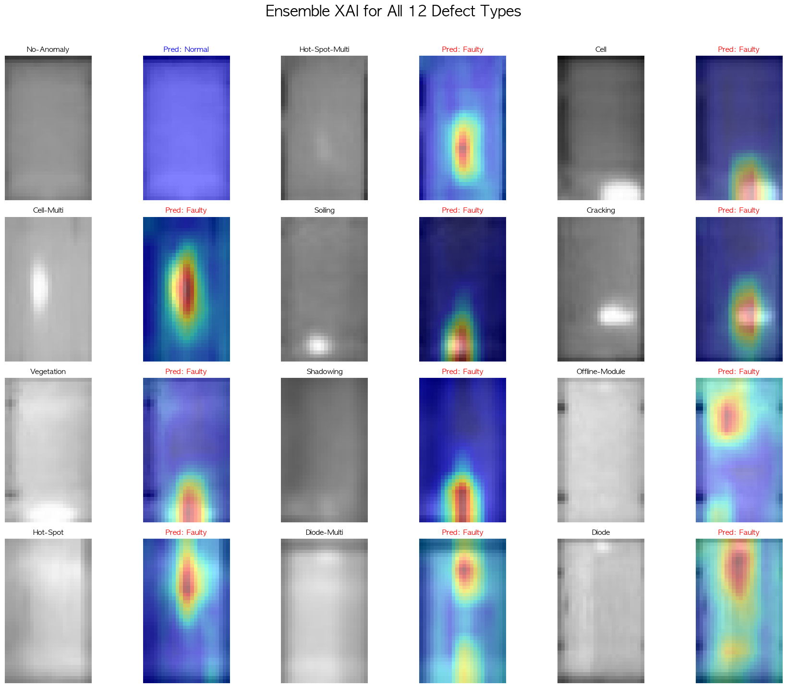
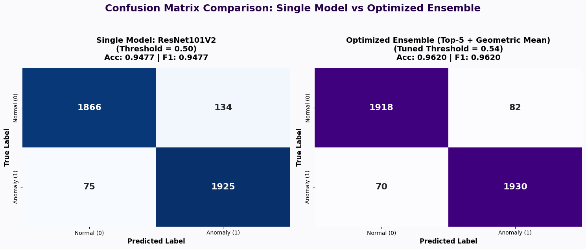
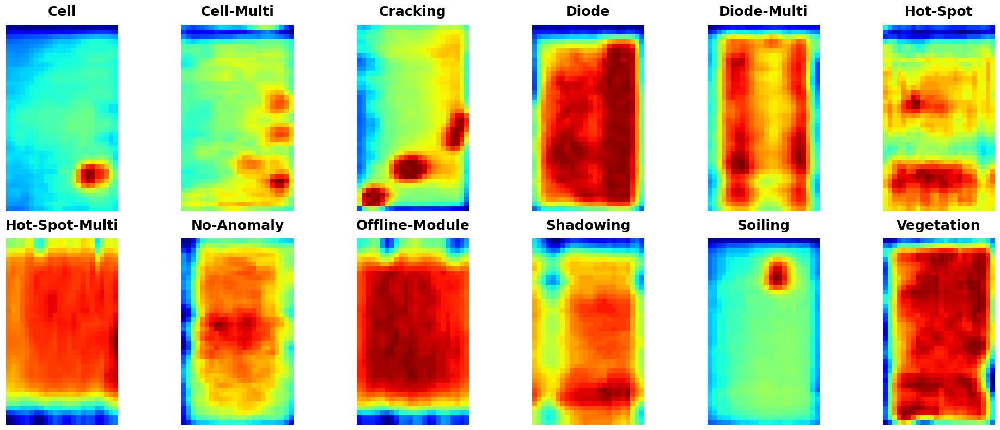
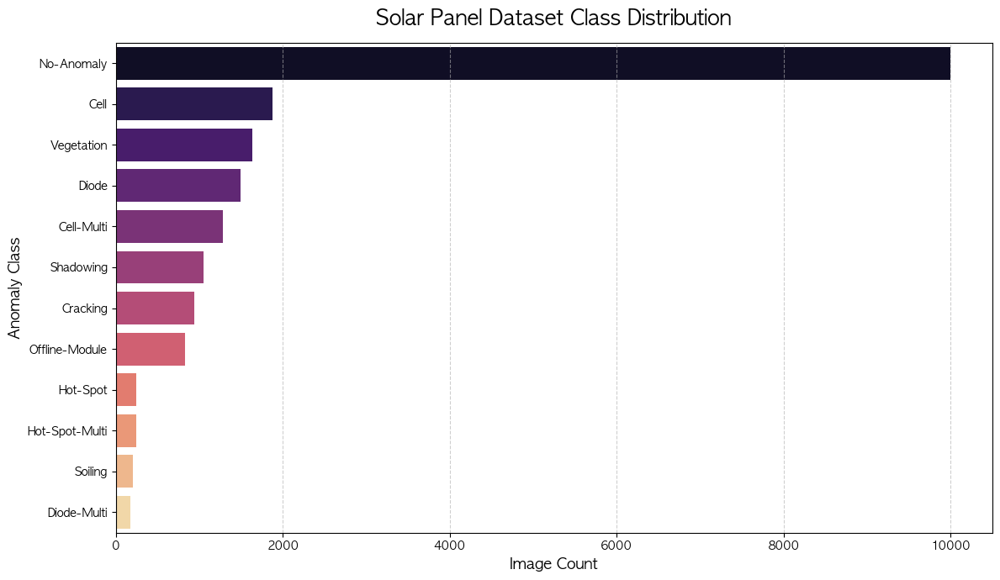
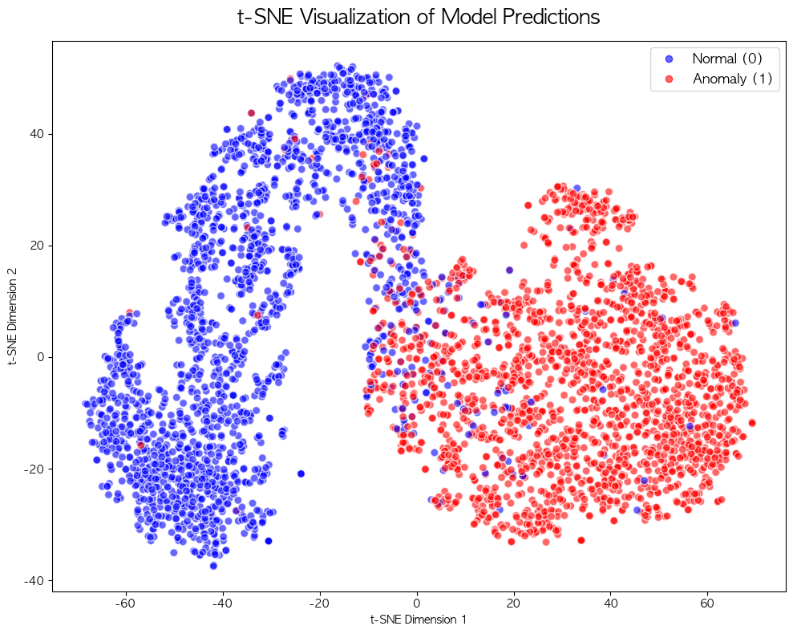
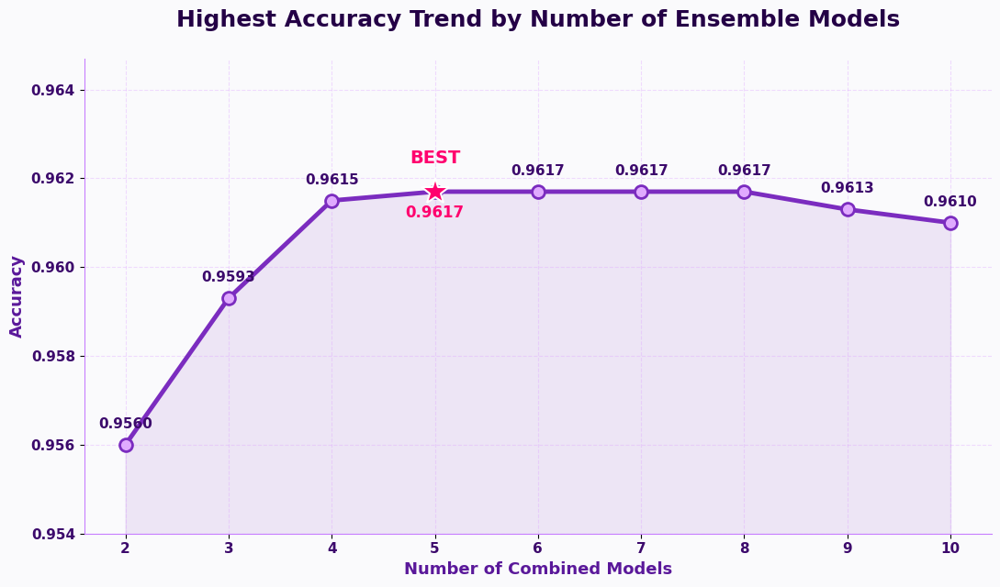
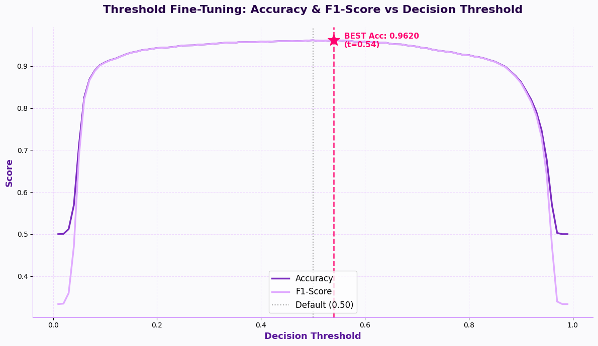

# 🔥 IR-Solar-Vision-Ensemble
> **딥러닝 앙상블 기반 열화상 태양광 패널 결함 탐지 최적화 프로젝트 (최종 정확도 96.2%)**

 

  
  <h3>"수만 장의 태양광 패널을 사람이 일일이 검사할 수 있을까요?"</h3>
  본 프로젝트는 캐글(Kaggle)의 <b>'Infrared Solar Modules' 데이터셋</b>을 활용하여, 실제 산업 현장에서 발생하는 태양광 패널의 치명적 결함(핫스팟, 다이오드 불량, 셀 파손 등)을 자동 탐지하는 AI 비전 모델입니다.  
  드론이나 점검 장비에 장착된 <b>열화상 카메라(Thermal Infrared)</b>로 촬영된 온도 분포 이미지를 분석함으로써, 사람의 육안으로는 절대 보이지 않는 패널 내부의 에너지 누수 및 결함까지 <b>96.2%의 높은 정확도</b>로 짚어냅니다.

 

---

## 🎯 1. Final Achievement (최종 성과)
단일 모델의 성능적 한계를 극복하기 위해 서로 다른 구조의 상위 5개 모델을 기하평균(Geometric Mean)으로 결합하여, **최종 테스트 분류 정확도(Accuracy) 96.2%** 라는 압도적인 결함 탐지 성능을 달성했습니다.

---

## 🌟 2. Explainable AI (XAI) 기반 정밀 이상 탐지
본 프로젝트의 앙상블 모델은 단순한 정상/결함 분류를 넘어, **결함의 위치를 시각적으로 완벽하게 짚어내는 설명 가능한 AI(XAI)** 능력을 갖추고 있습니다. 

> **12개 결함 유형별 앙상블 Grad-CAM 시각화**
> 정상(No-Anomaly) 데이터는 오탐지 없이 깔끔하게 통과시키고, Cell, Cracking, Hot-Spot 등 다양한 형태의 결함은 픽셀 단위로 정확하게 짚어냅니다. 최고 성능을 낸 5개의 SOTA 모델이 합의한 가장 신뢰도 높은 이상 탐지 결과입니다.

---

## 📈 3. Performance (성능 향상 증명)
단일 모델(ResNet101V2)에서 머물지 않고 앙상블 파이프라인을 거치며 성능이 비약적으로 상승했습니다.

### ✅ 혼동 행렬(Confusion Matrix) 성능 비교

> **(왼쪽) 최고 성능의 단일 모델 ➔ (오른쪽) 최종 최적화 앙상블 모델 (96.2%)**
> 앙상블 및 최적화를 거치면서 억울하게 결함으로 판정받는 오답(False Positive)과, 결함을 놓치는 치명적 실수(False Negative)가 눈에 띄게 줄어들었습니다. 이를 통해 전체 분류 정확도와 산업 현장에서의 신뢰도를 극대화했습니다.

---

## 📌 4. Project Overview
본 프로젝트는 **열화상 카메라(Thermal Infrared)로 촬영된 태양광 패널(PV) 이미지**를 분석하여 정상(Normal)과 결함(Anomaly)을 높은 정확도로 분류하는 고도화된 딥러닝 파이프라인 구축을 목표로 했습니다. 

이를 위해 **총 23개의 SOTA(State-of-the-Art) CNN 모델**을 학습시켰으며, 단순히 상위 모델을 합치는 것을 넘어 **30가지의 앙상블(Ensemble) 수학적 결합 기법을 전수조사**하여 최적의 조합을 찾아내고 임계치 미세 조정을 통해 인간의 인지 한계 수준까지 탐지 성능을 최적화했습니다.

---

## 📊 5. Dataset Overview

### 🔍 태양광 패널 결함 종류 (Anomaly Classes)

> Hot-Spot, Cracking, Soiling, Shadowing 등 다양한 열화상 결함 패턴을 딥러닝이 스스로 학습합니다.

### 📈 데이터 클래스 분포 (Class Distribution)

> 데이터 불균형(Class Imbalance) 문제를 고려하여 모델 학습 시 계층적 분할(Stratified Split) 기법을 적용했습니다.

### 🌌 원본 데이터 t-SNE 군집 시각화

> 고차원의 원본 이미지 데이터를 2차원 공간으로 축소(t-SNE)하여 시각화한 결과입니다. 정상(파란색)과 결함(빨간색) 데이터가 어떻게 분포되어 있는지, 두 클래스 간의 경계가 얼마나 모호한지(데이터의 난이도)를 사전에 분석했습니다.

---

## 🚀 6. Methodology (전처리 및 앙상블 최적화 파이프라인)
단순히 모델을 불러와 학습시키는 것을 넘어, 데이터 손실을 원천 차단하고 수천만 번의 연산을 통해 완벽한 앙상블 조합을 찾아내는 파이프라인을 구축했습니다.

### ① 이진 분류(Binary) 맵핑 및 무손실 데이터 전처리
- **편향(Bias) 방지를 위한 이진 분류 맵핑**: 원본 데이터는 12개의 결함 유형(Multi-class)으로 나뉘어 있었으나, 데이터 불균형으로 인해 샘플 수가 적은 유형일수록 탐지율이 떨어지는 모델 편향 현상이 발견되었습니다. 이를 근본적으로 해결하고자 데이터를 `Normal(정상)`과 `Faulty(결함)` 2가지로 재정의하여 모델 학습의 안정성과 탐지력을 극대화했습니다.
- **비율 왜곡 방지 패딩**: 원본 40x24 해상도의 이미지를 40x40으로 패딩(ZeroPadding2D) 처리하여 리사이징 시 발생하는 형태 왜곡을 방지했습니다.
- **무손실 채널 어댑터**: 흑백(1채널) 이미지를 컬러(3채널) 모델에 입력하기 위해, Conv2D 대신 텐서 복제(Lambda)를 사용하여 초기 이미지 손실을 원천 차단했습니다.
- 각 모델의 아키텍처에 맞춘 최적의 권장 해상도(예: 224x224)로 Bicubic 보간법을 통해 확대하고 전용 `preprocess_input`을 적용했습니다.

### ② 3단계 점진적 동결 해제 미세 조정 (Progressive Fine-Tuning)
- **[Stage 1] 분류기 웜업**: 사전 학습된 백본(Backbone) 네트워크를 완전히 동결하고 최상단 분류기만 먼저 학습시켜 초기 가중치가 파괴되는 현상을 막았습니다.
- **[Stage 2] 상위 50 레이어 미세 조정**: 모델의 상위 50개 레이어 동결을 해제하고, 낮은 학습률로 미세 조정을 수행했습니다. (BatchNormalization은 동결 유지)
- **[Stage 3] 최종 최적화**: 상위 75개 레이어까지 추가로 동결을 해제하고, `CosineDecay` 학습률 스케줄러를 적용해 전역 최적점(Global Minimum)에 안착시켰습니다.

### ③ Data Augmentation & Early Stopping
- `ImageDataGenerator`를 활용한 이미지 증강(회전, 반전 등)으로 모델의 일반화 성능을 높였으며, `EarlyStopping(patience=12)`을 23개 모델 전체에 적용하여 최상의 가중치를 확보하고 과적합을 방지했습니다.

### ④ 앙상블 전수조사 및 임계치 최적화 (Brute-Force Search & Threshold Tuning)
23개의 최상위 모델을 기반으로 2개부터 최대 23개까지 묶을 수 있는 모든 경우의 수에 대해, **총 30가지의 수학적 앙상블 결합 기법**을 교차 적용하여 수천만 회 이상의 연산을 수행했습니다.

> **[STEP 1] 결합 모델 수에 따른 최고 성능 추이** 
> 전수조사 결과, 상위 5개 모델을 **'기하평균(Geometric Mean)'** 으로 결합했을 때 최정점의 시너지가 남을 증명했습니다.

> **[STEP 2] 결정 임계치 최적화 (Threshold Fine-Tuning)**
> 앙상블 조합을 확정한 후, 마지막 화룡점정으로 기본 임계치인 0.50에 얽매이지 않고 F1-Score와 Accuracy를 동시에 모니터링하여 **가장 이상적인 커트라인(최적 임계치)** 을 세밀하게 튜닝함으로써 탐지 능력을 극한으로 끌어올렸습니다.

 

**[탐색에 사용된 30가지 앙상블 결합 기법]**
| No | 앙상블 기법명 (Method) | No | 앙상블 기법명 (Method) |
|:---:|:---|:---:|:---|
| 1 | 다수결투표 (Hard Voting) | 16 | 최대확률 (Max Probability) |
| 2 | 확률평균 (Arithmetic Mean) | 17 | 최소확률 (Min Probability) |
| 3 | 정확도가중 (Accuracy Weighted) | 18 | 최대최소평균 (Min-Max Mean) |
| 4 | F1가중 (F1 Weighted) | 19 | IQR평균 (Interquartile Range Mean) |
| 5 | 지수순위가중 (Exp Rank Weighted) | 20 | 순위평균 (Rank Mean) |
| 6 | Softmax가중 (Softmax Weighted) | 21 | 가중순위평균 (Weighted Rank Mean) |
| 7 | 기하평균 (Geometric Mean) | 22 | RRF(k=60) (Reciprocal Rank Fusion) |
| 8 | 조화평균 (Harmonic Mean) | 23 | Shannon엔트로피 (Entropy Weighted) |
| 9 | 중앙값 (Median) | 24 | Negentropy (Neg-Entropy Weighted) |
| 10 | 절사평균 (Trimmed Mean) | 25 | KL발산가중 (KL Divergence Weighted) |
| 11 | 윈저화평균 (Winsorized Mean) | 26 | Logit평균 (Logit Mean) |
| 12 | Power (p=0.5) | 27 | 신뢰도가중 (Confidence Weighted) |
| 13 | Power (p=2) | 28 | 곱규칙 (Product Rule) |
| 14 | Power (p=3) | 29 | Sharp가중 (Sharp Weighted) |
| 15 | Lehmer (p=2) | 30 | 역오차가중 (Inverse Error Weighted) |

---

## 🏆 7. Final Model Leaderboard (단일 모델 성능)
본 프로젝트에서 앙상블의 훌륭한 재료가 되어준 **총 23개 개별 모델들의 최종 리더보드**입니다. 

| 순위 | Model | Accuracy | F1-Score | Resolution | Version |
|:---:|:---|:---:|:---:|:---:|:---|
| 🥇 1 | **ResNet101V2** | 0.94775 | 0.947739 | 224 | Optimized |
| 🥈 2 | **ResNet101** | 0.94750 | 0.947463 | 224 | Optimized |
| 🥉 3 | **Xception** | 0.94725 | 0.947244 | 299 | Optimized |
| 4 | **ResNet50V2** | 0.94425 | 0.944244 | 224 | Optimized |
| 5 | **MobileNetV3Small** | 0.94400 | 0.943989 | 224 | Optimized |
| 6 | MobileNetV3Large | 0.94100 | 0.940987 | 224 | Optimized |
| 7 | ResNet50 | 0.93975 | 0.939734 | 224 | Optimized |
| 8 | InceptionResNetV2| 0.93925 | 0.939223 | 299 | Optimized |
| 9 | MobileNetV1 | 0.93675 | 0.936739 | 224 | Optimized |
| 10 | MobileNetV2 | 0.93350 | 0.933485 | 224 | Optimized |
| 11 | **DenseNet121** | 0.93325 | 0.933227 | 224 | Optimized |
| 12 | InceptionV3 | 0.93175 | 0.931711 | 299 | Optimized |
| 13 | EfficientNetV2S | 0.93075 | 0.930651 | 384 | Optimized |
| 14 | EfficientNetV2B0 | 0.92625 | 0.926145 | 224 | Optimized |
| 15 | EfficientNetV2B3 | 0.92475 | 0.924589 | 300 | Optimized |
| 16 | EfficientNetV2B1 | 0.92425 | 0.924153 | 240 | Optimized |
| 17 | EfficientNetV2B2 | 0.92300 | 0.922954 | 260 | Optimized |
| 18 | NASNetMobile | 0.90725 | 0.907191 | 224 | Optimized |
| 19 | EfficientNetB3 | 0.87200 | 0.870330 | 300 | Optimized |
| 20 | EfficientNetB4 | 0.85900 | 0.856957 | 380 | Optimized |
| 21 | EfficientNetB0 | 0.82050 | 0.815287 | 224 | Optimized |
| 22 | EfficientNetB2 | 0.81825 | 0.814965 | 260 | Optimized |
| 23 | EfficientNetB1 | 0.78400 | 0.774232 | 240 | Optimized |

> **💡 핵심 인사이트**: 단일 최고 모델(ResNet101V2)의 성능도 훌륭하지만, 각기 다른 강점을 지닌 상위 5개 모델을 30개의 수리적 결합 기법으로 전수 조사해 찾아낸 **기하평균(Geometric Mean)** 앙상블을 통해 **단일 모델의 한계점(0.947)을 완벽히 돌파해 96.2%를 달성**했습니다.

---

## 📚 8. References (출처 및 참고자료)
- **Data Source (원본 데이터셋)**: [Kaggle - Infrared Solar Modules](https://www.kaggle.com/datasets/marcosgabriel/infrared-solar-modules/data)
- **Methodology Reference (방법론 참고)**: [Kaggle - Solar Modules Fault Detection with CNN (PyTorch)](https://www.kaggle.com/code/aliakbaryaghoubi/solar-modules-fault-detection-with-cnn-pytorch)
- **Industrial Image Source (산업용 사진 출처)**: [MapperX - How to inspect solar power plants with drone](https://mapperx.com/en/pv-panel-inspection-software/how-to-inspect-solar-power-plants-with-drone/)
